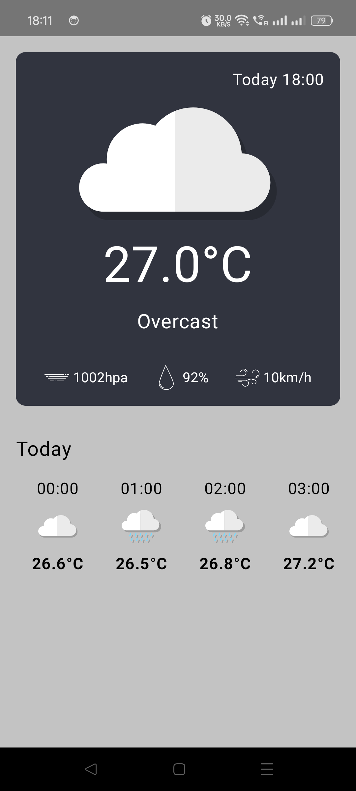

# Weather-App-MVI-Clean-Architecture
The MVI architecture follows a clear separation of concerns by dividing the application into three main components: Model, View, and Intent. 

---

## 📱 App Screenshot

---

## 🚀 Features

- ✅ Hourly weather forecast (temperature, humidity, pressure, wind speed, etc.)
- ✅ Current weather conditions
- ✅ Clean UI with weather icons
- ✅ Kotlin MVVM architecture
- ✅ Retrofit + Gson for network layer
- ✅ ViewModel + LiveData for lifecycle-aware data flow
- ✅ Dependency injection with Dagger-Hilt

---

## 🧱 Architecture

This app follows the **MVVM (Model-View-ViewModel)** pattern:

**Libraries Used:**

| Purpose             | Library                        |
|---------------------|--------------------------------|
| Networking          | Retrofit + Gson                |
| Dependency Injection| Dagger-Hilt                    |
| Architecture        | Android Jetpack (ViewModel, LiveData) |
| Language            | Kotlin                         |

---

## 🔌 Public Weather API

We use the [Open-Meteo API](https://open-meteo.com/) — a free weather API.
